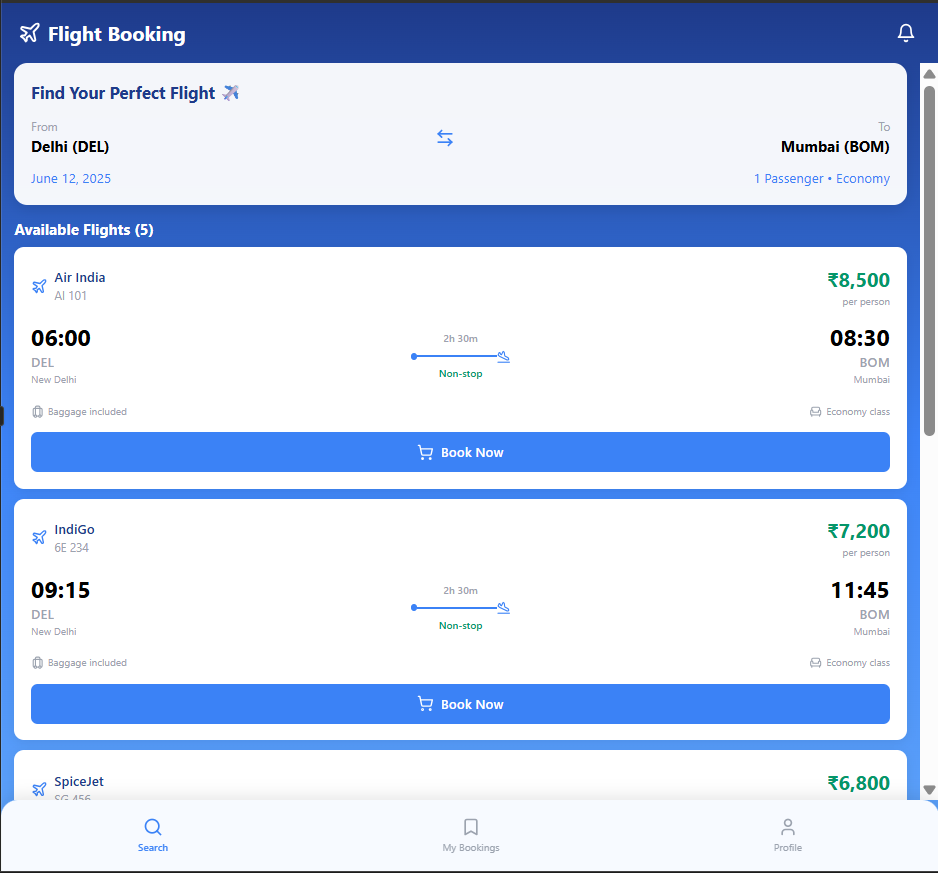
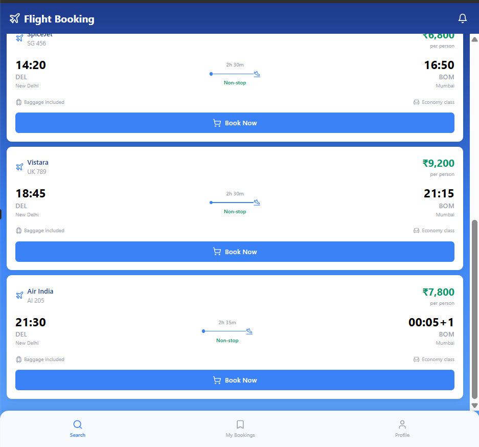
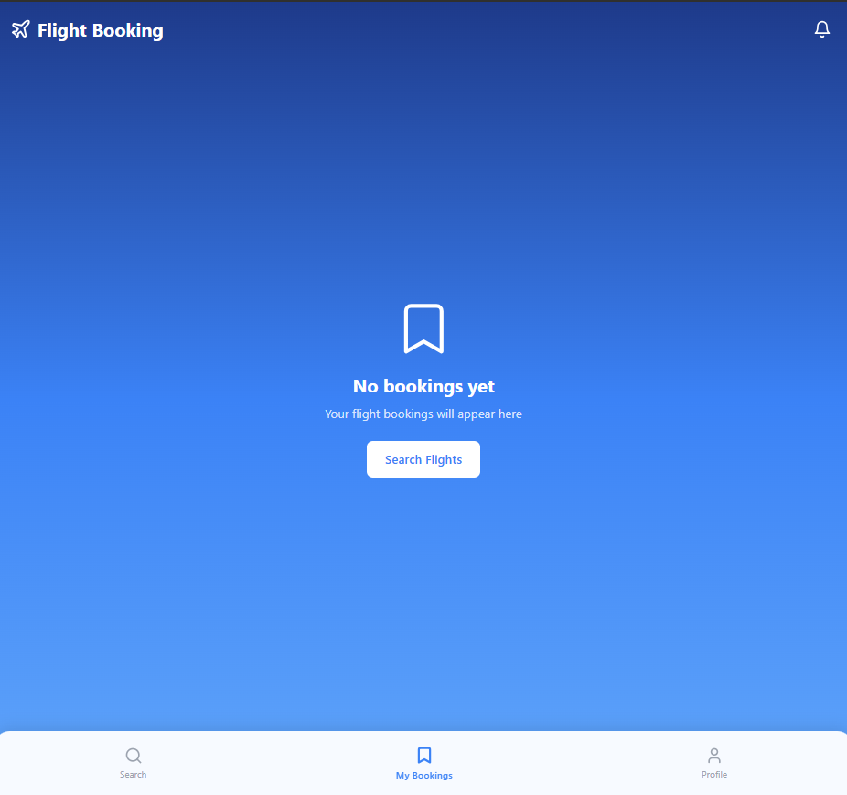
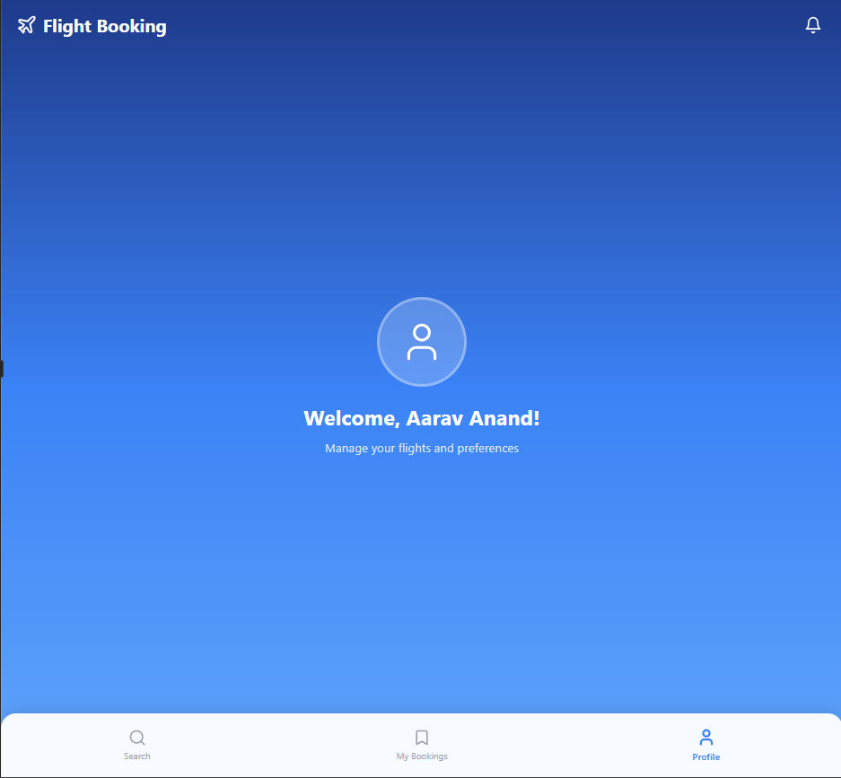

# Flight Booking Android App ✈️

Welcome to the **Flight Booking App** repository! This project was developed as part of the **Airbnb Virtual Internship Program** task.

This application is a modern, native Android app built using **Kotlin** and **Jetpack Compose**, designed to provide a seamless flight searching and booking experience.

## 📱 App Preview

Here are some glimpses of the application's user interface:

| Search & Home | Flight Results | Booking Details |
|:---:|:---:|:---:|
|  |  |  |

| My Bookings | 
|:---:|
|  | 

## 🚀 Features

*   **Smart Flight Search:** Easily search for flights between cities with date selection.
*   **Real-time Results:** View a list of available flights with details like airline, price, duration, and timings.
*   **Booking Management:** A dedicated "My Bookings" section to track your reservations.
*   **User Profile:** Personalized profile section ensuring a tailored experience.
*   **Modern UI:** Built with **Jetpack Compose** for a fluid, responsive, and beautiful user interface.

## 🛠️ Technology Stack

*   **Language:** [Kotlin](https://kotlinlang.org/) - First-class language for Android development.
*   **UI Toolkit:** [Jetpack Compose](https://developer.android.com/jetpack/compose) - Android's modern toolkit for building native UI.
*   **Material Design 3:** Implements the latest Material Design guidelines for a stunning look and feel.

## 📂 Project Structure

This repository follows a simplified structure focusing on the core logic and UI implementation in `MainActivity.kt`.

## 👨‍💻 Developed By

**Aarav Anand**
*   *Airbnb Virtual Internship Program*

---
*Thank you for checking out this project!*
